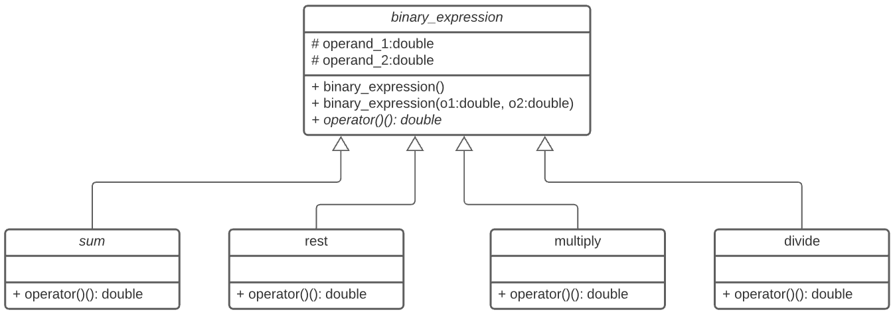
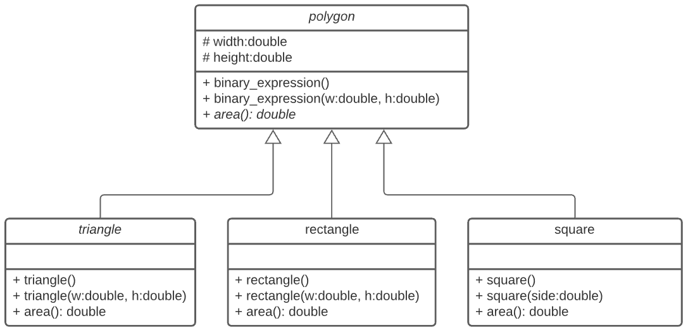
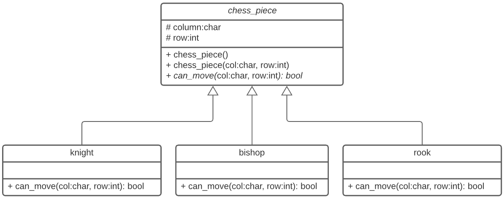

# Set de Problemas #6

Ejercicios sobre herencia, polimorfismo y sobrecarga del curso de programación orientada a objetos 1 (CS1102).

## Ejercicio #1 - Operaciones Binarias

### Problem Statement


Escribir un programa que utilizando la clase **`bynary_operation`** y las clases derivadas **`sum, rest, multiply y divide`** genere un vector polimorfico, que permita almacenar **`n`** operaciones, ingresando el tipo de operación (S=suma, R=Resta, M=Multiplicación y D=División) y sus 2 operados del tipo **`double`**, el programa debe de retornar la suma total de las operaciones, para lo cual el resultado de cada operación debe obtenerse utilizando el operador sobrecargado **`()`** (ver diagrama y Use Case) :



### Use Case
```cpp
    int n = 0;
    cin >> n;
    vector<binary_expression*> operations(n);
    for (auto& item: operations) {
        char type{};
        int o1{};
        int o2{};
        cin >> type >> o1 >> o2;
        switch(type) {
            case 'S':
                item = new sum(o1, o2);
                break;
            case 'R':
                item = new rest(o1, o2);
                break;
            case 'M':
                item = new multiply(o1, o2);
                break;
            case 'D':
                item = new divide(o1, o2);
                break;
        }
    }
    // sum of operations
    double result = 0;
    for (auto& item: operations)
        result += (*item)();    // USO DEL OPERADOR() SOBRECARGADO
    // show result
    cout << result;

    // release objects
    for (auto& item: operations)
        delete item;

    // clear vector
    operations.clear();
```

### Input Format
```bash
    4
    S 1 1
    R 10 5
    M 2 2
    D 10 2
```

### Constraints
```bash
- No utilizar etiquetas
- Numeros enteros
```

### Output Format
```bash
    16
```

## Ejercicio #2 - Poligonos
Escribir un programa que utilizando la clase **`polygon`** y las clases derivadas **`triangle, rectangle y square`** genere un vector polimorfico, que permita almacenar **`n`** poligonos, ingresando el tipo de poligono (T=Triangulo, R=Rectangulo y C=Cuadrado) y sus dimensiones, En caso de triangulo y rectangulo: base y altura y en caso de cuadrado: lado, todos ellos del tipo **`double`**, el programa debe de retornar la suma total de las areas, para lo cual el resultado de cada operación debe obtenerse utilizando el operador sobrecargado **`+=`** (ver definición):

```cpp
    double& operator+=(double& result, polygon& rvalue);
```


### Use Case
```cpp
    int n = 0;
    cin >> n;
    vector<polygon*> polygons(n);
    for (auto& item: polygons) {
        char type{};
        int w{};
        int h{};
        cin >> type;
        switch(type) {
            case 'T':
                cin >> w >> h;
                item = new triangle(w, h);
                break;
            case 'R':
                cin >> w >> h;
                item = new rectangle(w, h);
                break;
            case 'C':
                cin >> w;
                item = new square(w);
                break;
        }
    }
    // sum of operations
    double result = 0;
    for (auto& item: polygons)
        result += *item;
    // show result
    cout << result;
    // release objects
    for (auto& item: polygons)
        delete item;
    // clear vector
    polygons.clear();
```

### Input Format
```bash
    5
    R 10 11
    R 100 5
    C 20
    T 1 2
    C 3
```

### Constraints
```bash
- No utilizar etiquetas
- Numeros enteros
```

### Output Format
```bash
    1020
```
## Ejercicio #3 - Piezas de Ajedrez
Escribir un programa que utilizando la clase **`chess_piece`** y las clases derivadas **`knight, rook y bishop`** genere un vector polimorfico, que permita almacenar **`n`** poligonos, ingresando el tipo de piecas (K=Caballo, R=Torre y B=Alfil) y sus posiciones expresadas por la columna (desde A hasta H) y la fila(desde 1 hasta 8), el programa recibira adicionalmente una posicion valida en el tablero del ajedres y debe confirmar para cada pieza ingresada con el valor de **`true/false`** y seguido por su identificación **`pieza(columna fila)`** si la pieza puede moverse a esa posición, el operador **`<<`** debe ser sobrecargado (ver definición):

```cpp
    ostream& operator<<(ostream& out, chess_piece& piece);
```



### Use Case
```cpp
    int n = 0;
    cin >> n;
    vector<chess_piece*> pieces(n);
    for (auto& item: pieces) {
        char type{};
        char c{};
        int r{};
        cin >> type >> c >> r ;
        switch (type) {
            case 'K':
                item = new knight(c, r);
                break;
            case 'R':
                item = new rook(c, r);
                break;
            case 'B':
                item = new bishop(c, r);
                break;
        }
    }
    char c2;
    int r2;
    cin >> c2 >> r2;
    for (auto& item: pieces)
        cout << boolalpha << item->can_move(c2, r2) << " - " << *item << endl;
```
### Input Format
```bash
    6
    K F 1
    R H 3
    B G 4
    B B 2
    B D 7
    R E 6
    D 2
```

### Constraints
```bash
- No utilizar etiquetas
- Numeros enteros
```

### Output Format
```bash
    true - K(F1)
    false - R(H3)
    true - B(G4)
    false - B(B2)
    false - B(D7)
    false - R(E6)
```


